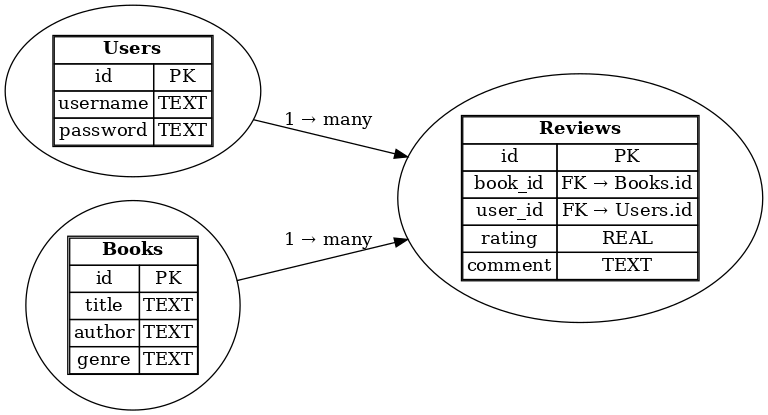

# 📚 Book Review API

## 📝 Overview
The Book Review API is a RESTful service built using **Node.js**, **Express.js**, and **SQLite**. It allows users to manage books and submit reviews with user authentication using JWT.

---

## 🚀 Features
- User Signup and Login with JWT Authentication
- Add New Books
- Get All Books with Filters (author, genre, search) and Pagination
- Get Book by ID with Average Rating and Reviews
- Submit, Update, and Delete Reviews (only by the owner)

---

## 🛠 Technologies Used
- Node.js
- Express.js
- SQLite (via `sqlite3` package)
- JWT Authentication
- Postman (for API testing)

---

## ⚙️ Setup Instructions

### 🔧 Prerequisites
- Node.js installed

### 🗂 Installation Steps
```bash
git clone https://github.com/Aditya367367/book-review-api
cd book-review-api
npm install
```

### ⚙️ Configuration
Create a `.env` file in the root directory with:
```
JWT_SECRET=your_secret_key
PORT=3000
```

### ▶️ Run the Application
```bash
npm start
```
Server will run on `http://localhost:3000`

---

## 📌 API Endpoints

### 🔐 Auth
- `POST /signup` - Register a new user
- `POST /login` - Login and receive JWT token

### 📘 Books
- `POST /books` - Add a new book
- `GET /books` - Get all books (with optional filters & pagination)
- `GET /books/:id` - Get a specific book by ID

### ✍️ Reviews
- `POST /books/:id/reviews` - Submit a review (requires JWT)
- `PUT /books/:id/reviews/:reviewId` - Update a review (requires JWT)
- `DELETE /books/:id/reviews/:reviewId` - Delete a review (requires JWT)

---

## 💻 Example API Requests

## 📝 Signup
```http
POST /signup
Content-Type: application/json

{
  "username": "Aditya",
  "password": "123456"
}
```

### 🔐 Login (Postman)
```http
POST /login
Content-Type: application/json
{
  "username": "Aditya",
  "password": "123456"
}
```

### 📘 Add Book (Postman)
```http
POST /books
Authorization: Bearer <token>
Content-Type: application/json
{
  "title": "Clean Code",
  "author": "Robert C. Martin",
  "genre": "Programming"
}
```

### ✍️ Submit Review (Postman)
```http
POST /books/1/reviews
Authorization: Bearer <token>
Content-Type: application/json
{
  "rating": 9,
  "comment": "Excellent book on clean code!"
}
```

---

## 📊 Database Schema

- `users` (id, username, password)
- `books` (id, title, author, genre)
- `reviews` (id, book_id, user_id, rating, comment)

---

## 📈 ER Diagram


---

## 💡 Design Decisions
- JWT used for secure user authentication.
- Users can submit only one review per book.
- Review CRUD operations are restricted to the owner.

---

## 👨‍💻 Author
**Aditya Chauhan**

---

## 📄 License
MIT License
